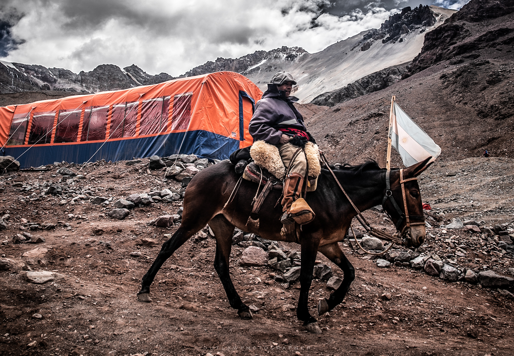

### Servicios loguisticos

En Pared Sur trabajamos con mulas de transporte propias por lo que garantizamos el seguro traslado de las cargas que transportamos y el arribo a destino en tiempo y forma.

Cada animal puede transportar un máximo de 60 kilos. Por esta razón requerimos no empacar cargas mayores a 30 kilos en un solo bulto, puesto que debemos balancear las cargas con un máximo de 30 kilos por cada lado de la mula.

## Arrieros

Los “Arrieros”, personajes históricos de la Argentina, son hombres duros y simples que viven en el campo y trabajan con animales casi desde que nacen. Trabajamos con un ratio de 1 arriero con 3 mulas cargadas para poder garantizar la seguridad de los equipos transportados. Ellos cargan y descargan las mulas, ayudan a los escaladores a cruzar los caudalosos ríos de montaña y compartirán contigo su invaluable conocimiento del área.

## Personal permanente en campamentos

En Confluencia, Plaza de Mulas y Plaza Argentina tenemos encargados de campamentos en forma permanente. Ellos realizan trabajos de coordinación como recibir y despachar el equipo transportado por las mulas. Contamos con comunicación radial para reservar tus mulas de regreso desde cualquier punto en la montaña. and how the law protects You. Please read Our Privacy Policy carefully before using Our Service.

## Servicios incluidos

- Transporte de cargas en nuestras mulas propias hacia los principales campamentos base del Cº Aconcagua.

- Asistencia para la obtención del Permiso de Ingreso al Parque Provincial Aconcagua.

- Asistencia en el embalaje de carga para asegurar la protección de sus equipos y alimentos.

- Depósito de bultos en Penitentes, Confluencia y en Plaza de Mulas (No incluye Plaza Argentina).

- El transporte en vehículo de los escaladores desde el lugar de alojamiento (Puente del Inca o Penitentes) hasta el inicio de la caminata de las diferentes rutas de aproximación Horcones o Punta de Vacas.

- Derecho al uso del baño en los Campamentos.

- Evacuación gratuita de los residuos en caso que se contrate el servicio ida y vuelta.

- Contamos con radio para solicitar las mulas para el descenso.
