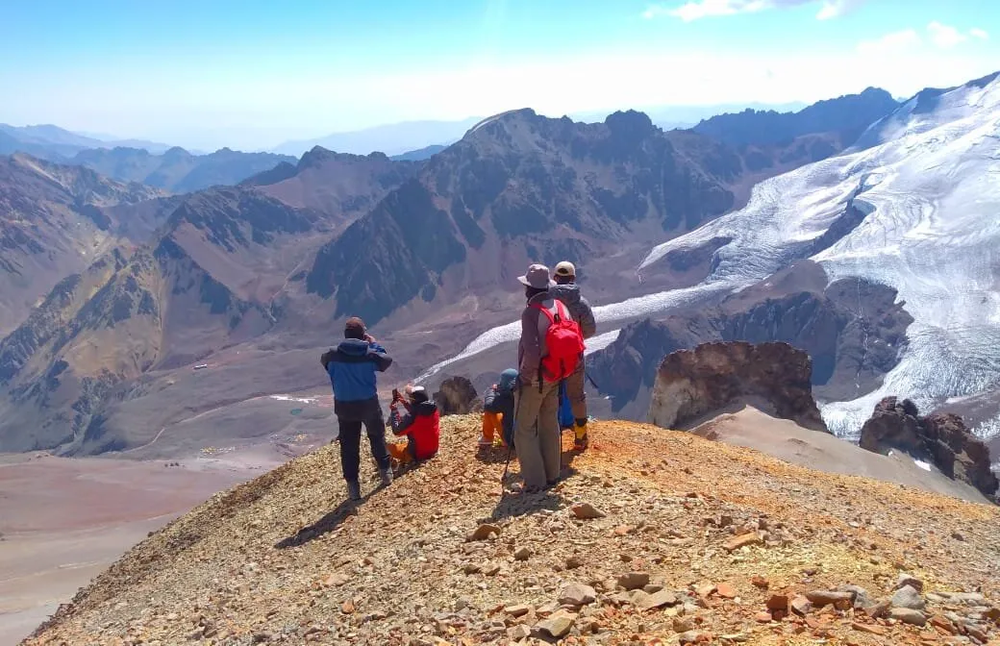

Te invitamos a vivir una experiencia única: además de descubrir la majestuosa Plaza Francia y su imponente Pared Sur, y explorar Plaza de Mulas, el principal campamento base del Cerro Aconcagua, te proponemos llegar a la cumbre del Cerro Bonete (5000 mts). Desde allí, tendrás una vista exclusiva e impresionante de la Pared Oeste del Aconcagua.

| Día        | Ubicación                            | Altitud    |
| :--------- | :----------------------------------- | :--------: |
| Día Previo | Mendoza                              | 760 Mts    |
| 01         | Penitentes - Confluencia             | 3368 Mts   |
| 02         | Confluencia – Plaza Francia          | 4200 Mts   |
| 03         | Confluencia – Plaza de Mulas         | 4250 Mts   |
| 04         | Descanso en Plaza de Mulas           | 4250 Mts   |
| 05         | Ascenso al C° Bonete                 | 5000 Mts   |
| 06         | Descanso en Plaza de Mulas           | 4250 Mts   |
| 07         | Regreso Plaza de Mulas - Penitentes  | -          |

